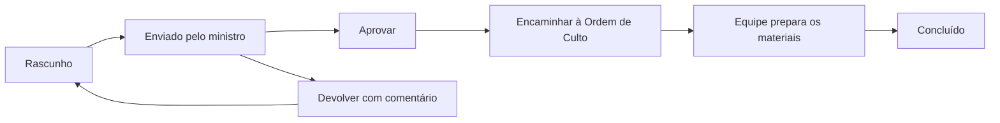

# API: Repertório de Louvor

## Objetivo

O repertório é um fluxo próprio, ligado ao culto e à área de Música, mas independente da escala. Ele garante que somente músicas aprovadas pela liderança de louvor sejam encaminhadas à equipe de Ordem de Culto.

## Preparação organizacional

Antes de usar o fluxo, configure as áreas globais **Música** e **Ordem de Culto**, suas equipes e integrantes. Na equipe de louvor, a liderança deve atribuir a função operacional `WORSHIP_MINISTER` ao participante que será o Ministro de Louvor. No evento de culto, inclua ambas as áreas. A ordem de culto deve conter o item `Louvor` vinculado à área de Música.

## Fluxo

1. Um integrante ativo da área de Música cria o repertório em rascunho.
2. O Ministro de Louvor envia para aprovação o repertório de qualquer culto em que esteja com escala confirmada.
3. Líderes de área, campus ou equipe de Música podem aprovar ou devolver com um comentário.
4. Após aprovado, a liderança encaminha o repertório para a área de Ordem de Culto.
5. As músicas tornam-se materiais do item `Louvor` e uma pendência é criada para a equipe de Ordem de Culto.
6. Quando essa equipe conclui a pendência, o repertório passa a `COMPLETED`.



## Estados

| Status | Significado |
| --- | --- |
| `DRAFT` | Repertório em preparação. |
| `SUBMITTED` | Aguarda a revisão do líder de louvor. |
| `RETURNED` | Foi devolvido com comentário para ajuste. |
| `APPROVED` | Foi aprovado e pode ser enviado à Ordem de Culto. |
| `SENT_TO_WORSHIP_ORDER` | Músicas e pendência foram encaminhadas para a equipe responsável. |
| `COMPLETED` | A equipe de Ordem de Culto concluiu a pendência. |

## Prazo de envio e escala

- O envio para aprovação é permitido para todos os cultos `WORSHIP` aprovados em que o Ministro de Louvor possua uma escala com status `CONFIRMED` na equipe de louvor.
- Para os cultos regulares de domingo e quinta-feira, a data-limite calculada é a segunda-feira daquela semana, às `23:59:59` no horário de São Paulo.
- A API devolve `submissionDeadline` e `isLateSubmission` nas consultas e nas respostas do repertório, para o sistema informar o prazo ao ministro.
- Depois do prazo, o repertório ainda pode ser enviado para aprovação. Ele recebe o indicador de atraso e os líderes de louvor são notificados com esse aviso.

## Permissões

- Somente o participante com a função operacional ativa `WORSHIP_MINISTER` na equipe de louvor pode criar, editar e enviar o próprio repertório.
- `GENERAL_LEADER`, `CAMPUS_LEADER` e `TEAM_LEADER` ativos da área de Música revisam e encaminham repertórios do respectivo campus.
- `WORSHIP_ORDER_MANAGER`, `SECRETARY`, `ADMIN`, `SUPER_ADMIN` e `PASTOR` também podem operar o fluxo.
- Integrantes ativos da área que recebeu a pendência podem concluí-la na ordem de culto.

## Endpoints

| Método | Rota | Finalidade |
| --- | --- | --- |
| `POST` | `/worship-repertoires` | Cria o repertório com músicas iniciais. |
| `GET` | `/worship-repertoires/event/:eventId` | Lista repertórios do culto. |
| `GET` | `/worship-repertoires/:id` | Consulta o repertório completo. |
| `POST` | `/worship-repertoires/:id/songs` | Adiciona música em rascunho ou devolvida. |
| `PATCH` | `/worship-repertoires/songs/:id` | Edita uma música. |
| `DELETE` | `/worship-repertoires/songs/:id` | Remove uma música. |
| `PATCH` | `/worship-repertoires/:id/songs/order` | Reordena todas as músicas. |
| `PATCH` | `/worship-repertoires/:id/submit` | Envia ao líder de louvor. |
| `PATCH` | `/worship-repertoires/:id/return` | Devolve para ajuste. |
| `PATCH` | `/worship-repertoires/:id/approve` | Aprova o repertório. |
| `PATCH` | `/worship-repertoires/:id/send-to-worship-order` | Encaminha músicas e pendência para a Ordem de Culto. |

A atribuição de Ministro de Louvor é feita no módulo de áreas de serviço, descrito em [Funções Operacionais de Equipe](service-operational-roles.md).

## Criar e enviar

```json
POST /worship-repertoires
{
  "eventId": "uuid-do-culto",
  "serviceAreaId": "uuid-da-area-de-musica",
  "songs": [
    {
      "sequencia": 1,
      "titulo": "Nome da Canção",
      "tom": "G",
      "artista": "Autor ou banda",
      "referencia": "https://exemplo.com/repertorio"
    }
  ]
}
```

Depois, envie usando `PATCH /worship-repertoires/:id/submit`.

## Revisar e encaminhar

Para devolver, o comentário é obrigatório:

```json
PATCH /worship-repertoires/:id/return
{
  "comentario": "Ajustar o tom da segunda música e reenviar."
}
```

Para aprovar, o comentário é opcional. Depois, encaminhe para a equipe operacional:

```json
PATCH /worship-repertoires/:id/send-to-worship-order
{
  "orderItemId": "uuid-do-item-louvor",
  "receivingServiceAreaId": "uuid-da-area-ordem-de-culto",
  "dueAt": "2026-08-13T18:00:00.000Z"
}
```

O encaminhamento cria os materiais do item de louvor e uma pendência para a área de Ordem de Culto. O alerta coletivo da ordem publicada e o PDF passam a mostrar essas músicas e a pendência correspondente.
